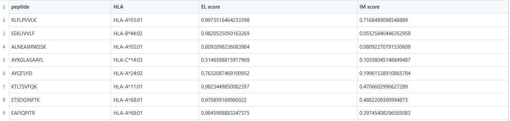

# IEPAPI: A method for immune epitope prediction by incorporating antigen presentation and immunogenicity

_ _ _ _

## 1.  System requirements

#### 1) Dependencies and operating systems

python(version=3.7.9); torch(version=1.8.0)；torchvision(version==0.2.2); numpy(version==1.18.5); pandas(version=1.2.4); tqdm(version=4.19.9); matplotlib(version=3.3.2); seaborn(version=0.11.1);weblogo(version=3.7.12)

It is recommended to use the linux system, here we used Centos Linux release 7.9.2009(Core) system.

#### 2) Required non-standard hardware

We employed Tesla K80 and Intel(R) Xeon(R) CPU E5-2678 v3 @2.50GHz.

#### 3) Version information

This is the 1th version which has been tested on independent antigen presentation and immunogenicity test datasets.

## 2.  Installation guide

Download the source code and unzip it. Simply enter the directory of IEPAPI and install all required dependencies on your operating system:

```console
cd ./IEPAPI-main
pip install -r dependencies.txt
```

## 3. Demo

### 3.1 Prediction Demo

- Organize your input information in the following format:
  
  

- Run the command to make a prediction：
  
  ```console
  python IEPAPI_predict.py --input test.csv --output output_demo.csv
  ```

- --input: the first column is the sequence of the peptide, the second column is the name of the HLA, and the third column is the pseudo-sequence of the HLA. The file ". /data/pseudoSequence(ELIM).csv" records the pseudo sequences of all HLA isoforms used in this study. For other HLA isoforms, their pseudo sequences can be found in the file ". /data/NetMHCpan4.1/MHC_pseudo.dat".

- --output: the path where you want to save the prediction results. Here, the expected output will be saved in the file "./output_demo.csv".
  
  

### 3.2 Immune Epitope Motif Demo

- Run the command to obtain the immune epitope motif for the specified HLA：
  
  ```console
  python IEPAPI_motif.py --MHC HLA-A*11:01 --MHCseq YYAMYQENVAQTDVDTLYIIYRDYTWAAQAYRWY --require_pdf True
  ```

- --MHC: the name of the MHC molecule

- --MHCseq: the pseudo-sequence of the MHC molecule

- --require_pdf: If set to False, only images in JPEG format are output. If set to True, images in PDF format will also be output.

- For HLA-A*11:01, both motifs for antigen presentation and immunogenicity will be generated in the format of heatmaps and sequence logos, which can reflect the immune epitope pattern.
  
  


## 4. Reproduction guidance

a) Download all data from the Mendeley Data website (https://data.mendeley.com/datasets/fwxg5mgntn) and place the data in the ". /data/processed" directory

b）Training the IEPAPI-EL model

```console
 python  main_train_Model_EL.py   --fold 0   --index 0
 python  main_train_Model_EL.py   --fold 1   --index 0
 python  main_train_Model_EL.py   --fold 2   --index 0
 python  main_train_Model_EL.py   --fold 3   --index 0
 python  main_train_Model_EL.py   --fold 4   --index 0
```

c）Training the IEPAPI-IM model

```console
 python  main_train_Model_IM.py   --fold 0   --index 0
 python  main_train_Model_IM.py   --fold 1   --index 0
 python  main_train_Model_IM.py   --fold 2   --index 0
 python  main_train_Model_IM.py   --fold 3   --index 0
 python  main_train_Model_IM.py   --fold 4   --index 0
```

d）Make predictions for the test datasets

```console
 python IEPAPI_predict.py --input ./data/processed/DataS3.csv --output ./output/results/DataS3_by_IEPAPI.csv
 python IEPAPI_predict.py --input ./data/processed/DataS4.csv --output ./output/results/DataS4_by_IEPAPI.csv
 python IEPAPI_predict.py --input ./data/processed/DataS5.csv --output ./output/results/DataS5_by_IEPAPI.csv
```
